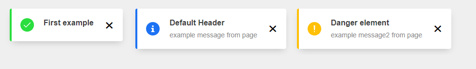

# Lit alert element

This component used https://github.com/lit-elements/seed-element/tree/b78bb2f4fd30c755a209c13cce70bf5cac003f6d as a seed

## Parameters

| Name  | type  | default  | description  |
|---|---|---|---|
| type  | string  |  "danger" | It can be danger, info or succes. each value changes alert icon and left side color.  |
|  header |  string |  "Default Header" |  It will be create a header on the alert content |
|  message |  string |  - |  It will be create a description on the alert content |

## Methods

| Name  | return  | description  |
|---|---|---|
| closeAlert  | -  | When you want to close alert you can use this  |

## Examples

```html
<lit-alert-element header="First example" type="success"></lit-alert-element>
```
```html
<lit-alert-element message="example message from page" type="info"></lit-alert-element>
```
```html
<lit-alert-element header="Danger element" message="example message2 from page" type="danger"></lit-alert-element>
```


